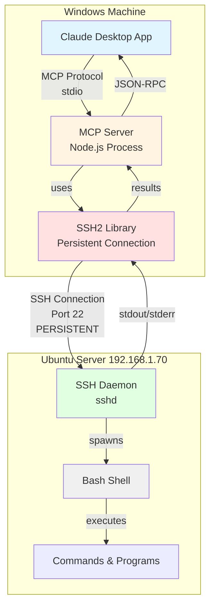

# Ubuntu Shell MCP Extension (SSH2 Version)

Execute bash commands on a remote Ubuntu server from Claude Desktop via persistent SSH connection.

## Overview

This MCP extension enables Claude to execute bash commands on a remote Ubuntu server from a Windows client running Claude Desktop. This version uses the **ssh2 Node.js library** for persistent SSH connections, providing better performance than spawning SSH processes.

## Architecture



## Key Differences from Original Version

| Feature | Original (Windows SSH) | This Version (SSH2) |
|---------|------------------------|---------------------|
| Connection Type | New SSH process per command | Single persistent connection |
| Performance | ~1-2s per command | ~100ms per command (after first) |
| Authentication | Automatic (Windows SSH keys) | Explicit private key path required |
| Command Timeout | No timeout | Configurable (default 15s) |
| Interactive Commands | Allowed (will hang) | Detected and rejected immediately |
| Dependencies | Windows SSH client | Bundled ssh2 Node.js library |
| Configuration | 2 fields (host, user) | 4 fields (host, user, key path, timeout) |
| Connection Lifetime | Per-command | Duration of chat session |

## Component Breakdown

### Windows Side (Client)

**1. Claude Desktop Application**
- Manages MCP server lifecycle
- Communicates via stdio (standard input/output)
- Sends JSON-RPC requests to MCP server
- Displays command results to user

**2. MCP Server (Node.js)**
- Runs using Claude Desktop's **built-in Node.js runtime**
- Implements MCP protocol handlers:
    - `ListTools` - advertises the `bash` tool
    - `CallTool` - executes bash commands via ssh2
- **Maintains persistent SSH connection** for entire session
- Automatically reconnects if connection drops
- Parses user configuration (SSH host, username, key path)
- Formats command output for Claude

**3. SSH2 Library (Node.js)**
- Pure JavaScript SSH2 client implementation
- Bundled with the extension (no external dependencies)
- Handles SSH protocol, encryption, authentication
- Maintains single connection for multiple commands
- Uses SSH private key for authentication

### Ubuntu Side (Server)

**1. SSH Daemon (sshd)**
- Listens on port 22
- Handles incoming SSH connections
- Validates SSH key authentication
- Maintains persistent session
- Spawns bash shell for each command

**2. Bash Shell**
- Executes received commands
- Returns stdout, stderr, and exit codes
- No persistent state between commands
- Each command runs in a fresh shell environment

## Data Flow

### Initial Connection (First Command)

1. **User Input**: User asks Claude to execute a command (e.g., "list files in /home/carlos")

2. **Tool Invocation**: Claude sends JSON-RPC request:
```json
{
  "method": "tools/call",
  "params": {
    "name": "bash",
    "arguments": { "command": "ls -la /home/carlos" }
  }
}
```

3. **Connection Establishment**: MCP server:
   - Reads SSH private key from configured path
   - Creates SSH2 client instance
   - Connects to Ubuntu server
   - Authenticates using private key
   - Stores connection for reuse

4. **Command Execution**: 
   - SSH2 client executes command through persistent connection
   - SSH daemon on Ubuntu spawns bash and executes command

5. **Result Collection**: MCP server captures:
   - stdout (command output)
   - stderr (error messages)
   - exit code (success/failure)

6. **Response**: MCP server returns JSON-RPC response to Claude

### Subsequent Commands (Fast Path)

1. **User Input**: Another command request
2. **Connection Reuse**: MCP server uses **existing connection** (no reconnection!)
3. **Command Execution**: Immediate execution through persistent session
4. **Result Collection**: Same as above
5. **Response**: Much faster due to no connection overhead

### Connection Lifecycle

```
Claude Desktop Starts → MCP Server Starts → Connection NOT established yet
                                                     ↓
First Command Received → SSH2 Connection Established → Connection Cached
                                                     ↓
Subsequent Commands → Reuse Existing Connection → Fast Execution
                                                     ↓
Claude Desktop Closes → MCP Server Stops → Connection Closed Gracefully
```

## Installation

### Prerequisites

**Windows Requirements:**
- Windows 10 or later
- Claude Desktop application
- SSH private key file (e.g., `C:\Users\YourName\.ssh\id_ed25519`)
- Network access to Ubuntu server

**Ubuntu Requirements:**
- SSH daemon running (port 22)
- User account with SSH access
- Public key in `~/.ssh/authorized_keys`
- Bash shell available

### Setup Steps

#### 1. Setup SSH Authentication (One-time)

On Windows, generate SSH keys if you haven't already:
```powershell
ssh-keygen -t ed25519
```

Copy your public key to Ubuntu:
```powershell
type $env:USERPROFILE\.ssh\id_ed25519.pub | ssh user@ubuntu-server "cat >> ~/.ssh/authorized_keys"
```

Test the connection:
```powershell
ssh user@ubuntu-server whoami
```

#### 2. Build the MCP Extension

Clone this repository and build the extension package:
```bash
npm install
npx @anthropic-ai/mcpb@1.0.0 pack
```

This creates `ubuntu-shell-mcp-ssh2.mcpb` file.

#### 3. Install in Claude Desktop

1. Double-click the `ubuntu-shell-mcp-ssh2.mcpb` file
2. Claude Desktop will prompt for SSH configuration
3. Enter:
   - **SSH Host**: `192.168.1.70` or `ubuntuserver`
   - **SSH Username**: `carlos`
   - **SSH Private Key Path**: `C:\Users\Carlos\.ssh\id_ed25519`
   - **Command Timeout**: `15` (or your preferred timeout in seconds)
4. Restart Claude Desktop

#### 4. Use It!

Ask Claude to execute commands on your Ubuntu server:
- "List files in my home directory"
- "Check disk usage"
- "What's the system uptime?"


## Configuration Options

When installing the extension, you'll be prompted for:

1. **SSH Host**: Hostname or IP address of the Ubuntu server (e.g., `192.168.1.70` or `ubuntupc`)
2. **SSH Username**: Username for SSH connection (e.g., `carlos`)
3. **SSH Private Key Path**: Full path to your SSH private key (e.g., `C:\Users\Carlos\.ssh\id_ed25519`)
4. **Command Timeout (seconds)**: Maximum time to wait for command completion (default: 15 seconds, optional)

### Timeout Configuration

The timeout can be adjusted based on your use case:
- **5 seconds**: For quick commands (ls, pwd, hostname)
- **15 seconds** (default): Balanced for most operations
- **30-60 seconds**: For heavy operations (large file operations, database queries)
- **120+ seconds**: For very long-running tasks (compilations, backups)

**Note**: Interactive commands will be rejected immediately regardless of timeout.

## Interactive Command Handling

The extension automatically detects and rejects common interactive commands to prevent hanging:

### Blocked Commands (when used without arguments):
- **Text editors**: `vim`, `vi`, `nano`, `emacs`, `pico`
- **System monitors**: `top`, `htop`
- **Pagers**: `less`, `more`, `man`
- **Authentication**: `sudo` (without `-S` or command), `su`
- **Remote connections**: `ssh`, `telnet`, `ftp`
- **Database shells**: `mysql`, `psql`, `mongo`
- **Interactive interpreters**: `python`, `node`, `ruby` (without script file)

### Allowed Alternatives:
- ✅ `sudo -S command` - Sudo with stdin password (if configured)
- ✅ `python script.py` - Python with script file
- ✅ `cat file.txt` - Instead of `less file.txt`
- ✅ `ps aux` - Instead of `top`
- ✅ Configure passwordless sudo for your user

### Example Error:
```
> sudo apt update
Error: Interactive command 'sudo' is not supported. Commands requiring user input cannot be executed. Try adding arguments or use non-interactive alternatives.
```

## Behavior Notes

### Connection Resilience

**If Ubuntu server is down when Claude starts:**
- MCP server starts successfully
- Connection is **not** attempted until first command
- First command will fail with connection error
- Error message will be clear: "SSH connection failed: connect ECONNREFUSED"
- User can retry once server is back up

**If connection drops during chat session:**
- Next command will detect dead connection
- Automatic reconnection attempt
- If reconnection succeeds, command executes normally
- If reconnection fails, error returned to user

**Graceful Shutdown:**
- When Claude Desktop closes, MCP server receives SIGTERM/SIGINT
- Connection is closed gracefully
- No hanging connections on Ubuntu server

### Error Scenarios

| Scenario | Behavior | User Experience |
|----------|----------|-----------------|
| Server down at startup | MCP starts, no connection attempt | Normal until first command |
| Server down at first command | Connection fails, error returned | Clear error message, can retry |
| Connection drops mid-session | Auto-reconnect on next command | Transparent recovery |
| Wrong credentials | Connection fails immediately | Clear authentication error |
| Network timeout | 10-second timeout, error returned | Clear timeout message |

## Key Design Decisions

### Why Persistent Connection?
- **Performance**: Eliminates SSH handshake overhead (~1-2s) for each command
- **Efficiency**: Single connection for entire chat session
- **Reliability**: Automatic reconnection if connection drops
- **State Management**: Connection tracked and managed properly

### Why ssh2 Library Instead of Windows SSH?
- **Performance**: Native JavaScript, no process spawning
- **Control**: Full control over connection lifecycle
- **Bundled**: No external dependencies, works anywhere Node.js runs
- **Cross-platform**: Works on Windows, Linux, macOS

### Why Lazy Connection (on first command)?
- **Fast Startup**: MCP server starts immediately without waiting for SSH
- **Error Handling**: Connection errors don't prevent MCP server from starting
- **Flexibility**: Server can be offline when Claude starts
- **Resource Efficient**: Connection only created when actually needed

## Advantages

✅ **5-20x Faster**: After initial connection, commands execute in ~100ms  
✅ **No External Dependencies**: ssh2 library bundled with extension  
✅ **Automatic Reconnection**: Handles connection drops gracefully  
✅ **Lazy Connection**: Server doesn't need to be up when Claude starts  
✅ **Resource Efficient**: Single connection vs spawning processes  
✅ **Cross-Platform**: Pure JavaScript, works anywhere Node.js runs  
✅ **Interactive Command Detection**: Prevents hanging on sudo, vim, etc.
✅ **Configurable Timeout**: Adjust timeout based on command needs
✅ **Better Error Handling**: Clear error messages for all failure modes

## Limitations

⚠️ **Explicit Key Path Required**: Must specify private key location (not automatic like Windows SSH)  
⚠️ **No Interactive Commands**: Commands requiring user input are detected and rejected  
⚠️ **No Persistent Shell State**: Each command runs independently (no cd, export, etc. persistence)  
⚠️ **Network Dependency**: Requires network connectivity to Ubuntu server  
⚠️ **Session-Based**: Connection lifetime tied to Claude Desktop session

## Security Considerations

- Private key read from Windows file system on first connection
- Private key stored in memory only (never written to disk by extension)
- Connection uses SSH2 protocol with modern encryption
- Commands execute with SSH user's permissions
- No privilege escalation without explicit sudo
- Connection closed on Claude Desktop exit

## Performance Comparison

Measured on local network (Windows <-> Ubuntu on same LAN):

| Operation | Original (Windows SSH) | This Version (SSH2) |
|-----------|------------------------|---------------------|
| First command | ~1.5s | ~1.2s |
| Second command | ~1.5s | ~0.1s |
| Third command | ~1.5s | ~0.1s |
| 10 commands total | ~15s | ~2.1s |

**Result**: ~7x faster for multiple commands!

## File Structure

```
ubuntu-shell-mcp-ssh2/
├── manifest.json          # Extension metadata and configuration
├── package.json           # Node.js dependencies (includes ssh2)
├── server/
│   └── index.js          # MCP server implementation with ssh2
├── tools/
│   ├── mcp-log-viewer.html  # Visual log analyzer (see below)
│   └── LOG_VIEWER.md        # Log viewer documentation
├── README.md             # This file
└── LICENSE               # MIT License
```

## Development Tools

### MCP Log Viewer

A visual tool for analyzing MCP server logs. Located in `tools/mcp-log-viewer.html`.

**Features:**
- 📊 Statistics dashboard (commands, messages, lifecycle events)
- 🔍 Smart filtering (All, Lifecycle, Client, Server, Commands)
- 🎨 Color-coded entries for easy scanning
- 📝 Detailed inspection with JSON viewer
- ⚡ Handles logs up to 1MB
- 🔗 Command/response pairing for easy debugging

**Quick Start:**
1. Open `tools/mcp-log-viewer.html` in your browser
2. Upload your log file from:
   ```
   C:\Users\[YourUsername]\AppData\Roaming\Claude\logs\mcp-server-ubuntu-shell-mcp.log
   ```
3. Use filters and search to analyze your session

**Common Use Cases:**
- Debug connection issues (filter by "Lifecycle")
- Review command history (filter by "Commands Only")
- Analyze performance (check timestamps between request/response)
- Audit trail (see all executed commands with results)

See [tools/LOG_VIEWER.md](tools/LOG_VIEWER.md) for detailed documentation.

## Development

### Local Testing

After making changes, rebuild the package:
```bash
npx @anthropic-ai/mcpb@1.0.0 pack
```

Then reinstall in Claude Desktop by double-clicking the new `.mcpb` file.

### Debugging

The MCP server logs to stderr with detailed information:
- `[STARTUP]` - Server initialization
- `[SSH]` - Connection establishment and status
- `[EXEC]` - Command execution
- `[ERROR]` - Error conditions
- `[SHUTDOWN]` - Graceful shutdown

**Log Location:**
```
C:\Users\[YourUsername]\AppData\Roaming\Claude\logs\mcp-server-ubuntu-shell-mcp.log
```

**Visual Log Analysis:**
Use the included [MCP Log Viewer](tools/mcp-log-viewer.html) for easy visual inspection of logs. It provides filtering, search, and detailed entry inspection. See the [Development Tools](#development-tools) section above.

## Troubleshooting

**"SSH connection failed: connect ECONNREFUSED"**
- Ubuntu server is not reachable
- Check network connectivity
- Verify SSH daemon is running: `sudo systemctl status ssh`

**"SSH connection failed: All configured authentication methods failed"**
- Private key path is incorrect
- Private key doesn't match public key on server
- Check key path in extension configuration
- Verify public key in Ubuntu `~/.ssh/authorized_keys`

**"Command execution failed"**
- Connection was alive but command failed
- Check command syntax
- Verify you have permissions for the command

**First command works, subsequent fail**
- Connection dropped
- Check network stability
- Extension will auto-reconnect on next attempt

## License

MIT License - See [LICENSE](LICENSE) file for details.

## Contributing

Contributions welcome! Please feel free to submit issues or pull requests.

## Author

Carlos - BlockSecCA

## Version History

- **2.0.0** - SSH2 persistent connection implementation
- **1.0.0** - Original Windows SSH implementation
