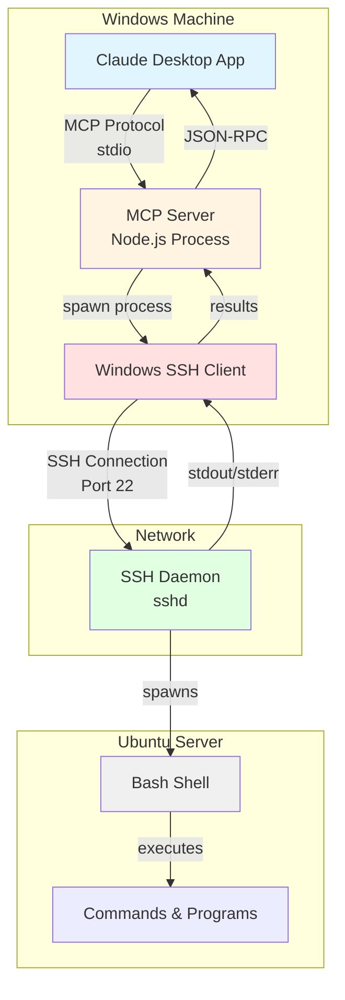
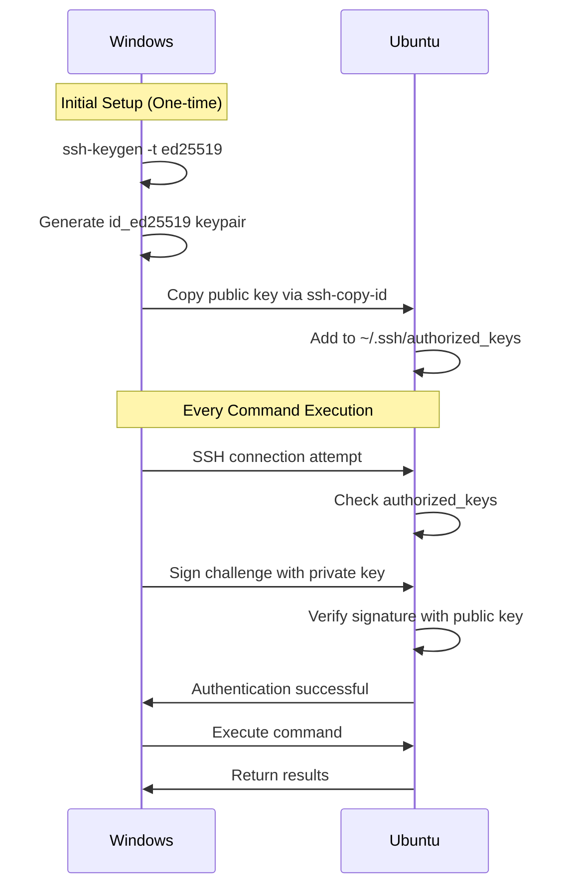

# Ubuntu Shell MCP Extension

Execute bash commands on a remote Ubuntu server from Claude Desktop via SSH.

## Overview

This MCP extension enables Claude to execute bash commands on a remote Ubuntu server from a Windows client running Claude Desktop. The architecture uses the Model Context Protocol (MCP) with SSH as the transport mechanism.

## Architecture



## Component Breakdown

### Windows Side (Client)

**1. Claude Desktop Application**
- Manages MCP server lifecycle
- Communicates via stdio (standard input/output)
- Sends JSON-RPC requests to MCP server
- Displays command results to user

**2. MCP Server (Node.js)**
- Runs using Claude Desktop's **built-in Node.js runtime**
- Implements MCP protocol handlers:
    - `ListTools` - advertises the `bash` tool
    - `CallTool` - executes bash commands via SSH
- Parses user configuration (SSH host, username)
- Manages SSH process spawning
- Formats command output for Claude

**3. Windows SSH Client**
- Native Windows OpenSSH client
- Spawned as child process by MCP server
- Handles SSH protocol, encryption, authentication
- Uses SSH keys from `~/.ssh/id_ed25519` for authentication

### Ubuntu Side (Server)

**1. SSH Daemon (sshd)**
- Listens on port 22
- Handles incoming SSH connections
- Validates SSH key authentication
- Spawns bash shell for each command

**2. Bash Shell**
- Executes received commands
- Returns stdout, stderr, and exit codes
- No persistent state between commands
- Each command runs in a fresh shell environment

## Data Flow

### Command Execution Sequence

1. **User Input**: User asks Claude to execute a command (e.g., "list files in /home/carlos")

2. **Tool Invocation**: Claude decides to use the `bash` tool and sends JSON-RPC request:
```json
{
  "method": "tools/call",
  "params": {
    "name": "bash",
    "arguments": { "command": "ls -la /home/carlos" }
  }
}
```

3. **SSH Connection**: MCP server spawns SSH process:
```bash
ssh -o BatchMode=yes -o ConnectTimeout=10 carlos@ubuntuserver "ls -la /home/carlos"
```

4. **Authentication**: SSH client uses key-based authentication (`~/.ssh/id_ed25519`)

5. **Command Execution**: SSH daemon on Ubuntu spawns bash and executes command

6. **Result Collection**: MCP server captures:
   - stdout (command output)
   - stderr (error messages)
   - exit code (success/failure)

7. **Response Formatting**: MCP server returns JSON-RPC response:
```json
{
  "content": [{
    "type": "text",
    "text": "[output]\n(exit code: 0)"
  }]
}
```

8. **Display**: Claude presents results to user in natural language

## Installation

### Prerequisites

**Windows Requirements:**
- Windows 10 or later (includes OpenSSH)
- Claude Desktop application
- SSH keys configured (`~/.ssh/id_ed25519`)
- Network access to Ubuntu server

**Ubuntu Requirements:**
- SSH daemon running (port 22)
- User account with SSH access
- Public key in `~/.ssh/authorized_keys`
- Bash shell available

### Setup Steps

#### 1. Setup SSH Authentication (One-time)

On Windows, generate SSH keys if you haven't already:
```powershell
ssh-keygen -t ed25519
```

Copy your public key to Ubuntu:
```powershell
type $env:USERPROFILE\.ssh\id_ed25519.pub | ssh user@ubuntu-server "cat >> ~/.ssh/authorized_keys"
```

Test the connection:
```powershell
ssh user@ubuntu-server whoami
```

#### 2. Build the MCP Extension

Clone this repository and build the extension package:
```bash
npm install
npm run pack
```

This creates `ubuntu-shell-mcp.mcpb` file.

#### 3. Install in Claude Desktop

1. Double-click the `ubuntu-shell-mcp.mcpb` file
2. Claude Desktop will prompt for SSH configuration
3. Enter your Ubuntu server hostname/IP (e.g., `192.168.1.70` or `ubuntuserver`)
4. Enter your SSH username (e.g., `carlos`)
5. Restart Claude Desktop

#### 4. Use It!

Ask Claude to execute commands on your Ubuntu server:
- "List files in my home directory"
- "Check disk usage"
- "What's the system uptime?"

## Key Design Decisions

### Why Local MCP Server on Windows?
- **Simplicity**: No server-side installation required on Ubuntu
- **Built-in Runtime**: Uses Claude Desktop's bundled Node.js
- **Easy Configuration**: GUI for SSH connection settings
- **No Ubuntu Setup**: Only requires standard SSH daemon

### Why SSH as Transport?
- **Already Available**: Windows 10+ includes OpenSSH
- **Secure**: Encrypted communication, key-based auth
- **Standard Protocol**: Well-tested, reliable
- **Stateless**: Each command is independent

### Why Stateless Commands?
- **Reliability**: No connection timeouts or state management
- **Simplicity**: No session cleanup required
- **Safety**: Each command runs in isolated environment
- **Flexibility**: Can execute any command without context dependencies

## Authentication Flow



## Advantages

✅ **No Ubuntu Installation**: Standard SSH daemon is all that's needed  
✅ **Secure**: SSH encryption + key-based authentication  
✅ **User-Friendly**: GUI configuration in Claude Desktop  
✅ **Reliable**: Stateless execution, no connection management  
✅ **Portable**: Works with any SSH-accessible Linux server  
✅ **Integrated**: Seamless experience within Claude chat

## Limitations

⚠️ **No Interactive Commands**: Cannot handle commands requiring user input  
⚠️ **No Persistent Sessions**: Each command runs independently  
⚠️ **Network Dependency**: Requires network connectivity to Ubuntu server  
⚠️ **Authentication Required**: Must setup SSH keys beforehand

## Security Considerations

- SSH keys stored in Windows user profile (`~/.ssh/`)
- Commands execute with SSH user's permissions
- No privilege escalation without explicit sudo
- SSH connection uses modern encryption (ed25519)
- BatchMode prevents password prompts (keys only)

## File Structure

```
ubuntu-shell-mcp/
├── manifest.json          # Extension metadata and configuration
├── package.json           # Node.js dependencies
├── server/
│   └── index.js          # MCP server implementation
├── README.md             # This file
└── LICENSE               # MIT License
```

## Development

### Local Testing

After making changes, rebuild the package:
```bash
npm run pack
```

Then reinstall in Claude Desktop by double-clicking the new `.mcpb` file.

### Debugging

The MCP server logs to stderr, which can be viewed in Claude Desktop's developer console or logs directory.

## License

MIT License - See [LICENSE](LICENSE) file for details.

## Contributing

Contributions welcome! Please feel free to submit issues or pull requests.

## Author

Carlos - BlockSecCA
